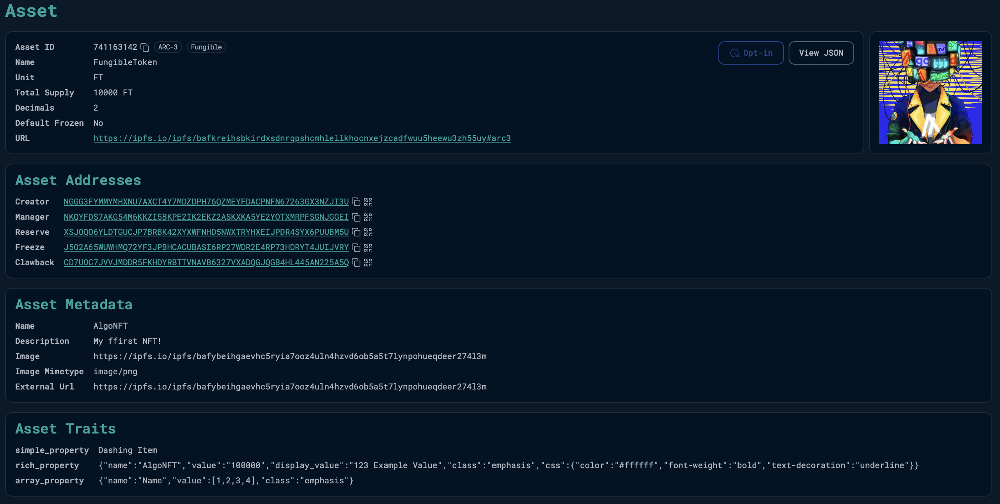

## Add Metadata and Asset Controls Results

The token was successfully created & Asset Config on Algorand TestNet with the following details:

- Asset ID: 741163142
- Asset Explorer URL: https://lora.algokit.io/testnet/asset/741163142
- Creation & Asset Config Transaction: https://lora.algokit.io/testnet/transaction/QWDB6NUNAHVIZJ4TKH7PVCY3QW4HA7XLKHBQLG5KWN3VO4TA73CQ

You can verify the token creation and its details using the provided URLs above. A screenshot of the successful creation is available in `Screenshot.png`.



# Add Metadata and Asset Controls to Algorand Standard Assets

This project demonstrates how to create an Algorand Standard Asset (ASA) with metadata and role-based access controls. The example creates a fungible token with 1,000,000 total supply, 2 decimal places, and implements various control addresses for asset management.

## Prerequisites

- Node.js installed on your system
- Basic understanding of Algorand blockchain
- Access to Algorand TestNet

## Installation

1. Clone the repository
2. Navigate to the project directory
3. Install dependencies:

```bash
npm install
```

## Project Structure

- `src/index.js`: Main script for creating ASA with metadata and controls
- `package.json`: Project dependencies and scripts

## Features

### Token Properties

- Total Supply: 1,000,000 tokens
- Decimals: 2
- Unit Name: "FT"
- Asset Name: "FungibleToken"

### Role-Based Access Controls

- **Manager Address**: Can change all future asset configuration settings
- **Reserve Address**: Account that holds the reserve (non-minted) units
- **Freeze Address**: Can freeze or unfreeze the asset holdings of specific accounts
- **Clawback Address**: Can transfer assets among accounts

## Usage

1. Run the asset creation script:

```bash
npm run create
```

2. The script will:
   - Generate random accounts for creator and control addresses
   - Display the wallet addresses
   - Provide a TestNet dispenser URL to fund the creator account
   - Create the asset with control addresses
   - Display the asset ID and explorer URL

## Code Example

```javascript
const asset = await algorand.send.assetCreate({
  sender: creator.addr,
  total: 1000000n,
  decimals: 2,
  unitName: "FT",
  assetName: "FungibleToken",
  manager: manager.addr,
  reserve: reserve.addr,
  freeze: freeze.addr,
  clawback: clawback.addr,
  url: "",
  defaultFrozen: false,
});
```

## Important Notes

1. Keep all private keys secure and never share them
2. The created asset will be visible on Algorand TestNet
3. Control addresses have significant power over the asset
4. Make sure to fund the creator account with TestNet ALGOs before creating the asset

## Viewing Your Asset

After creation, you can view your asset on the Algorand TestNet explorer using the provided URL:

```
https://lora.algokit.io/testnet/asset/<asset-id>
```

## Understanding Asset Controls

### Manager Address

- Can change the reserve, freeze, and clawback addresses
- Can modify the asset URL
- Cannot modify total supply, unit name, asset name, or decimals

### Reserve Address

- Holds non-minted asset units
- Important for assets that will be gradually released

### Freeze Address

- Can freeze or unfreeze asset holdings for specific accounts
- Useful for compliance and regulatory requirements

### Clawback Address

- Can transfer assets between accounts without signatures
- Useful for regulated assets and recovery of lost tokens

## Security Considerations

1. Carefully consider which addresses should have control capabilities
2. Document and secure all control address private keys
3. Consider setting some control addresses to empty for immutable assets
4. Test all control operations on TestNet before mainnet deployment
